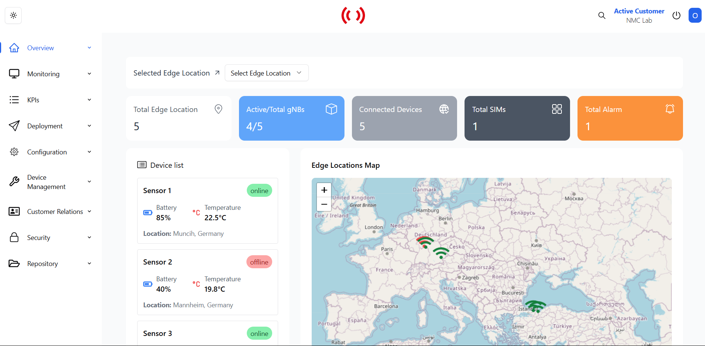

# NMC

This project is a web-based control panel that simplifies the management of IoT devices. With features such as real-time location tracking, visualization of critical data like battery and temperature, and anomaly detection via the ai model, it aims to optimize device performance and proactively identify potential issues. 

## Screenshots

<div align="center">

<table>
<tr>
<td width="50%">
<h3 align="center">Login</h3>

</td>
<td width="50%">
<h3 align="center">Dashboard</h3>

</td>
</tr>

<tr>
<td width="50%">
<h3 align="center">Device Overview</h3>

</td>
<td width="50%">
<h3 align="center">Performance Metrics</h3>

</td>
</tr>

<tr>
<td width="50%">
<h3 align="center">Network Status</h3>

</td>
<td width="50%">
<h3 align="center">Dark Theme</h3>

</td>
</tr>

<tr>
<td width="50%">
<h3 align="center">Quick Analysis</h3>

</td>
<td width="50%">
<h3 align="center">Anomaly Detection</h3>

</td>
</tr>

<tr>
<td width="50%">
<h3 align="center">Full Analysis</h3>

</td>
<td width="50%">
<h3 align="center">Customer Journey</h3>

</td>
</tr>

<tr>
<td colspan="2">
<h3 align="center">Footer</h3>

</td>
</tr>
</table>

</div>

##  Technologies

### Frontend
`React` • `TypeScript` • `TailwindCSS` • `Shadcn UI` • `React Query` • `React Router` •  `ApexCharts` • `Leaflet` • `Generative AI`

### Backend
`Node.js` • `Express.js` • `JWT` • `bcryptjs` • `CORS` • `nodemon` • `dotenv`


##  Getting Started

### Installation

1. Clone the repository:
```bash
git clone https://github.com/gzcmustafa/NMC.git
```

2. Install Frontend dependencies:
```bash
cd frontend
npm install
```

3. Install Backend dependencies:
```bash
cd backend
npm install
```

4. Set up environment variables:
   - Create `.env` files in both frontend and backend directories
   ### Frontend (.env)
   ```env
    VITE_API_BASE_URL=http://localhost:your_backend_port/api
    VITE_AI_TOKEN=your_ai_token
   ```
   ### Backend (.env)
   ```env
    PORT=your_backend_port
    JWT_SECRET=your_jwt_secret_key (example: supersetkey)
    JWT_EXPIRES_IN=1h
   ```
5. Start the application:

Frontend:
```bash
cd frontend
npm run dev
```

Backend:
```bash
cd backend
node server.js
```

##  Usage

1. Navigate to `http://localhost:5173` in your browser
   > Note: Vite uses port 5173 by default. Check your terminal for the exact URL if different.

2. Log in with test account:
   ```
   Email: test@example.com
   Password: password123
   ```
   
